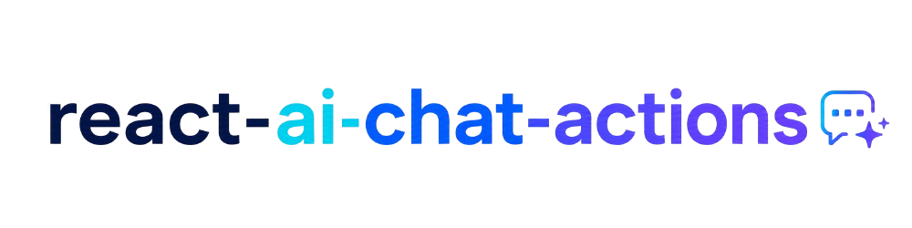

# react-ai-chat-actions

[](https://www.npmjs.com/package/react-ai-chat-actions)
[](https://www.npmjs.com/package/react-ai-chat-actions)
[](https://bundlephobia.com/package/react-ai-chat-actions)
[](./LICENSE)



React action toolbar for AI chat messages. Add like, dislike, copy, regenerate, speak, pin, and other message reaction buttons to ChatGPT-like interfaces, AI assistants, chatbot UIs, and React/Next.js chat apps.

**[Live demo →](https://react-ai-chat-actions.vercel.app/)**

---

## When to use

Use `react-ai-chat-actions` when you are building:

- AI chat message feedback controls
- ChatGPT-like assistant message actions
- Like/dislike/copy/regenerate buttons for LLM responses
- A React or Next.js chatbot UI that needs a polished message toolbar
- A reusable action bar with themes, tooltips, loading states, and a liquid glass hover effect

The package is a focused UI component for message-level actions. It does not manage chat state, send API requests, or store feedback for you.

---

## Install

```bash
npm install react-ai-chat-actions
```

---


## Usage

```tsx
import { ActionBar } from "react-ai-chat-actions";

<ActionBar
  messageId="msg-1"
  actions={["like", "dislike", "divider", "copy", "regenerate"]}
  onAction={(messageId, action) => console.log(messageId, action)}
/>;
```

---

## Props

| Prop                   | Type                          | Default      | Description                                          |
| ---------------------- | ----------------------------- | ------------ | ---------------------------------------------------- |
| `messageId`            | `string`                      | —            | Required. Passed back in `onAction`                  |
| `theme`                | `ThemeName`                   | `light-pill` | Theme preset, check type `ThemeName`                 |
| `visible`              | `boolean`                     | `true`       | Show or hide the bar                                 |
| `transparent`          | `boolean`                     | `false`      | Transparent background of bar                        |
| `actions`              | `ActionItem[]`                | —            | Built-in action names and/or custom action objects   |
| `onAction`             | `(messageId, action) => void` | —            | Callback on any button click                         |
| `activeActions`        | `ActionId[]`                  | —            | Controlled active state (like, pin, …)               |
| `defaultActiveActions` | `ActionId[]`                  | `[]`         | Initial active state (uncontrolled)                  |
| `onActiveActionsChange`| `(messageId, active) => void` | —            | Fires with the next active list on every toggle      |
| `copyText`             | `string \| () => string`      | —            | Enables built-in clipboard copy + "Copied" feedback  |
| `speakText`            | `string \| () => string`      | —            | Enables built-in text-to-speech via Web Speech API   |
| `icons`                | `Partial<Record<ActionType, ReactNode>>` | — | Override icons for built-in actions           |
| `loading`              | `ActionId[]`                  | `[]`         | Buttons in loading state                             |
| `disabled`             | `ActionId[]`                  | `[]`         | Buttons in disabled state                            |
| `ariaLabel`            | `string`                      | `Message actions` | Accessible name of the toolbar                  |
| `tooltip`              | `boolean`                     | `true`       | Show tooltips on hover                               |
| `liquidGlass`          | `boolean`                     | `false`      | Enable liquid glass hover effect                     |

### ActionType

```ts
type ActionType =
  | "like"
  | "dislike"
  | "heart"
  | "copy"
  | "regenerate"
  | "retry"
  | "speak"
  | "pin"
  | "bookmark"
  | "share"
  | "edit"
  | "report"
  | "translate"
  | "options"
  | "divider";
```


---

## Controlled active state

Toggle actions (`like`, `dislike`, `heart`, `speak`, `options`, `pin`, `bookmark`, and custom actions with `toggle: true`) track an active state. By default it lives inside the component. To persist it (e.g. feedback stored on your server), control it:

```tsx
const [active, setActive] = useState<ActionId[]>(["like"]); // from your API

<ActionBar
  messageId="msg-1"
  actions={["like", "dislike", "divider", "pin"]}
  activeActions={active}
  onActiveActionsChange={(messageId, next) => {
    setActive(next);
    saveFeedback(messageId, next);
  }}
  onAction={(messageId, action) => console.log(messageId, action)}
/>;
```

For uncontrolled usage with an initial value, use `defaultActiveActions` instead:

```tsx
<ActionBar defaultActiveActions={["like"]} ... />
```

`like` and `dislike` stay mutually exclusive in both modes. `onAction` fires on every click, including toggling off.

---

## Custom actions

Mix custom actions with built-in ones directly in the `actions` array:

```tsx
import { Sparkles } from "lucide-react";

<ActionBar
  messageId="msg-1"
  actions={[
    "like",
    "dislike",
    "divider",
    { id: "explain", icon: <Sparkles size={16} />, label: "Explain" },
    { id: "raw", icon: <Braces size={16} />, label: "Show raw", toggle: true },
  ]}
  onAction={(messageId, action) => {
    if (action === "explain") explainMessage(messageId);
  }}
/>;
```

| Field    | Type        | Default | Description                                         |
| -------- | ----------- | ------- | --------------------------------------------------- |
| `id`     | `string`    | —       | Passed to `onAction`; also used in `loading`/`disabled`/`activeActions` |
| `icon`   | `ReactNode` | —       | Any icon element                                    |
| `label`  | `string`    | —       | Tooltip text and `aria-label`                       |
| `toggle` | `boolean`   | `false` | Track active state like `like`/`pin`                |

---

## Custom icons

Override the icon of any built-in action without touching a custom action:

```tsx
import { Smile, Frown } from "lucide-react";

<ActionBar
  messageId="msg-1"
  actions={["like", "dislike", "divider", "copy"]}
  icons={{ like: <Smile size={16} />, dislike: <Frown size={16} /> }}
  onAction={(messageId, action) => console.log(messageId, action)}
/>;
```

`icons` only replaces the icon — the label, aria-label, and tooltip text stay the built-in default. Actions not listed in `icons` keep their default icon.

---

## Built-in handlers

The bar stays headless by default — `onAction` is yours. Two optional built-ins:

**Copy.** Pass `copyText` and the `copy` button writes to the clipboard and shows a "Copied" check for ~1.6s. `onAction` still fires.

```tsx
<ActionBar actions={["copy"]} copyText={message.content} ... />
// or lazy: copyText={() => serializeMessage(message)}
```

**Speak.** Pass `speakText` and the `speak` button reads the text aloud via the Web Speech API. The button stays active while speaking; clicking again stops it. Silently does nothing in browsers without `speechSynthesis`.

```tsx
<ActionBar actions={["speak"]} speakText={message.content} ... />
```

---

## Accessibility

The bar follows the [WAI-ARIA toolbar pattern](https://www.w3.org/WAI/ARIA/apg/patterns/toolbar/):

- `role="toolbar"` with an accessible name (`ariaLabel` prop, default `"Message actions"`)
- One tab stop for the whole bar; `←` `→` `↑` `↓` move between buttons, `Home`/`End` jump to first/last
- Visible `:focus-visible` outline on keyboard focus
- Tooltips show on keyboard focus, not only hover
- Toggle buttons expose `aria-pressed`, loading buttons `aria-busy`, dividers `role="separator"`
- With `ActionBarWrapper showOn="hover"`, the bar also appears on keyboard focus

---

## Themes

Twelve built-in themes: four color families (light, dark, neon, olive) × three shapes (pill, soft, sharp).

| Theme         | Shape                       |
| ------------- | --------------------------- |
| `light-pill`  | Light, fully rounded        |
| `light-soft`  | Light, slightly rounded     |
| `light-sharp` | Light, square corners       |
| `dark-pill`   | Dark, fully rounded         |
| `dark-soft`   | Dark, slightly rounded      |
| `dark-sharp`  | Dark, square corners        |
| `neon-pill`   | Neon glow, fully rounded    |
| `neon-soft`   | Neon glow, slightly rounded |
| `neon-sharp`  | Neon glow, square corners   |
| `olive-pill`  | Olive, fully rounded        |
| `olive-soft`  | Olive, slightly rounded     |
| `olive-sharp` | Olive, square corners       |

```tsx
<ActionBar theme="dark-sharp" ... />
```

---

## Liquid glass


Enable a glass-morphism sliding indicator that follows the cursor across buttons:

```tsx
<ActionBar
  liquidGlass={true}
  ...
/>
```

Works best on dark and neon themes.

---

## ActionBarWrapper

Wrap any component to attach the action bar to it. Controls position, visibility behavior, and layout mode.


```tsx
import { ActionBarWrapper } from "react-ai-chat-actions";

<ActionBarWrapper
  messageId="msg-1"
  actions={["like", "dislike", "copy"]}
  onAction={(id, action) => console.log(id, action)}
  verticalPosition="bottom"
  horizontalPosition="left"
  showOn="hover"
  float={false}
>
  <div className="message">AI response text goes here</div>
</ActionBarWrapper>;
```

### ActionBarWrapper props

| Prop                 | Type                            | Default    | Description                                   |
| -------------------- | ------------------------------- | ---------- | --------------------------------------------- |
| `children`           | `ReactNode`                     | —          | The component the bar attaches to             |
| `verticalPosition`   | `"top" \| "bottom"`             | `"bottom"` | Render bar above or below children            |
| `horizontalPosition` | `"left" \| "center" \| "right"` | `"right"`  | Horizontal alignment of the bar               |
| `showOn`             | `"always" \| "hover"`           | `"always"` | Show bar always or only on hover              |
| `float`              | `boolean`                       | `false`    | Absolute positioning — bar floats over layout |

All `ActionBar` props are also supported.

---

## AI coding assistant prompt

If you are using Codex, Claude Code, Cursor, Windsurf, or another AI coding assistant, ask for:

```text
Install react-ai-chat-actions and add message action buttons to my React chat UI.
Use ActionBar or ActionBarWrapper for like, dislike, copy, and regenerate actions.
```

The assistant should install the package, render `ActionBar` near each AI message, and handle `onAction(messageId, action)`. Styles are bundled and load automatically with the import.

---

## Examples

- [Basic React usage](./examples/basic-react/README.md)
- [Next.js chat message usage](./examples/next-chat-message/README.md)
- [AI feedback handling](./examples/ai-chat-feedback/README.md)
- [Custom actions](./examples/custom-actions/README.md)

---

## Roadmap

 - [ ] Label overrides / i18n
 - [ ] Animations
- [ ] Overflow menu for narrow containers

---

## License

MIT
